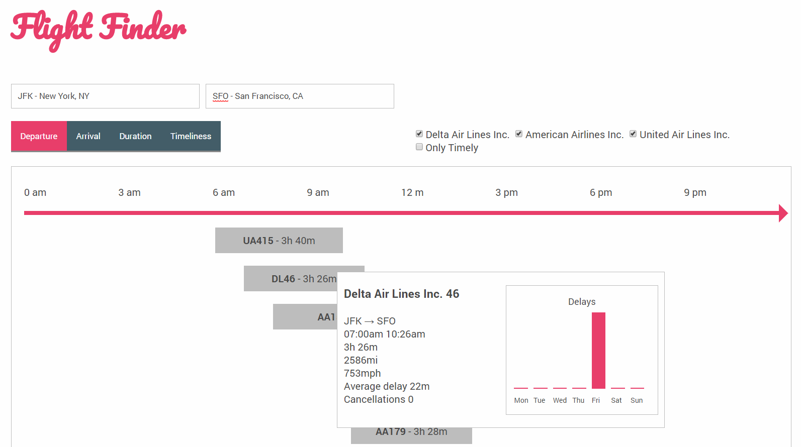

# FlightSearch

Flight search engine that allows the user to make decisions about flights basing on historical data (on a CSV file, no back-end code).

## Functionality

* When the user starts typing a city or airport code in any of the fields, it gets autocompleted
* If there’s input in one of the fields, the autocompletion propositions in the other are constrained only to cities/airports that have a connection from/to the city that’s already input.
* A flight is represented by a bar with its code (eg. AA32). The length of the bar is proportional to the length of the flight, and its positioning in the table matches the flight’s departure and arrival times.
* Clicking on one of the buttons sorts the table according in a way matching the clicked button’s label.
* If a checkbox is unchecked, the results for its airline are filtered out. Checking it again makes the results appear again.
* If the user hovers on one of the results. A tooltip with flight details will appear:
    * Full airline name.
    * Flight departure.
    * Flight arrival.
    * Flight length.
    * Flight distance.
    * Average speed.
    * Average delay
    * Cancellation count
    * A graph showing what is the average delay for every day of the week.
* The results table shows the flight duration
* When showing results in the autocomplete, the matching fragment stands out.
* An algorithm scores flights for timeliness. It takes in account the delays, cancellations, and how often the plane gets diverted to a different airport. Clicking on the “timeliness” button sorts the flights accordingly.
* Checking the “Only Timely Flight” hides the unreliable flights based on a negative timeliness score.

## Running the app
    cd dist/
    python -m SimpleHTTPServer

Now point your browser to http://localhost:8000/index.html.

To run in development mode:

    npm run start

## Implementation details

This project was developed on deployed using [create-react-app](https://github.com/facebookincubator/create-react-app)

The following tools were used:

* [ESLint](https://eslint.org/docs/user-guide/getting-started): Suggests a coding style to keep it clean.
* [Flow](https://flow.org/en/docs/react/): Static type checker to identify bugs at development time.
* [Redux](https://redux.js.org/docs/introduction/): State management.
* [React Redux](https://github.com/reactjs/react-redux): Connect React components with Redux in a High Order Component style.
* [Redux Thunk](https://github.com/gaearon/redux-thunk): Middleware to allow dispatching actions without passing redux all the way down the component tree.
* [D3 Fetch](https://github.com/d3/d3-fetch):  Convenient CSV parsing on top of Fetch to handle the sample data.
* [React Autocomplete](https://github.com/reactjs/react-autocomplete):  Autocomplete component for airport selectors.
* [React Flexbox Grid](https://github.com/roylee0704/react-flexbox-grid): Wrapper components for layout with CSS's flexbox.

## TODO

* Unit tests.
* Implement logic to handle flights ending the next day. This currently triggers some display and sorting issues on the `FlightChart` component.
* Enhance the `FlightChart` component using an advanced Gantt chart component.
* Render `FlightDetails` component on hover only for each row
* Display the time scale dynamically (according to the flights on screen)
* In the results table, show  the average duration calculated from historical data.
* In the timescale above the results, display times both in the origin and destination timezones.
* Make the airport/cities autocomplete tolerate typos (eg. typing “Nwe York” should return results for New York).
* Allow the user to parametrize your timeliness algorithms – for example, putting more weight on cancellations.
* Instant resorting of results may be confusing for the user. Make clicking a button sort the results in a visual way (animate the reshuffling of the results).
* Present more statistics: include not only the average but also the median delay.

## Data

Uncompress the data:

    tar -xzf data.tar.gz

Now you should have a `data` directory with one file, `2015-AA-UA-DL-flights.csv`.

`2015-AA-UA-DL-flights.csv` contains a row for every American Airlines, United Airlines or Delta flight in the US in 2015. It has the following columns:

- `FL_DATE` flight date, in YYYY-MM-DD format.
- `UNIQUE_CARRIER` carrier code
- `FL_NUM` flight number
- `ORIGIN` origin airport code
- `ORIGIN_CITY_NAME` origin city name
- `ORIGIN_STATE_ABR` origin state 2 letter code
- `DEST` destination (airport code)
- `DEST_CITY_NAME` destination city name
- `DEST_STATE_ABR` destination state 2 letter code
- `CRS_DEP_TIME` CRS departure time
- `DEP_TIME` actual departure time
- `DEP_DELAY` departure delay
- `CRS_ARR_TIME` CRS arrival time
- `ARR_TIME` actual arrival time
- `ARR_DELAY` arrival delay in minutes
- `CANCELLED` cancellation status (0 not cancelled, 1 cancelled)
- `DIVERTED` diversion status (0 for not diverted, 1 for diverted)
- `CRS_ELAPSED_TIME` CRS elapsed time in minutes
- `ACTUAL_ELAPSED_TIME` actual elapsed time in minutes
- `DISTANCE` distance in miles
- `CARRIER_DELAY` carrier delay, in minutes
- `WEATHER_DELAY` weather delay, in minutes
- `NAS_DELAY` National Air System delay, in minutes		
- `SECURITY_DELAY` security delay, in minutes.
- `LATE_AIRCRAFT_DELAY` late aircraft delay, in minutes.

`CRS` in field names means _computer reservation system_, and it refers to the timetable times. All times are *local*. The format is military time with leading zeros missing (so `1` means `00:01` – one minute after midnight).
